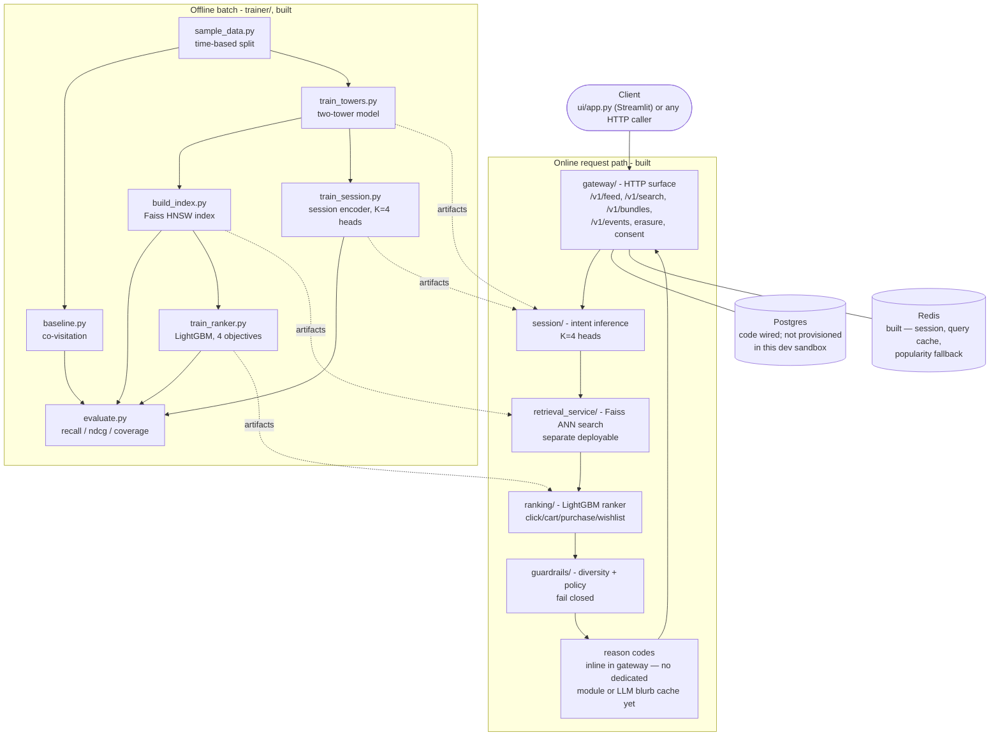
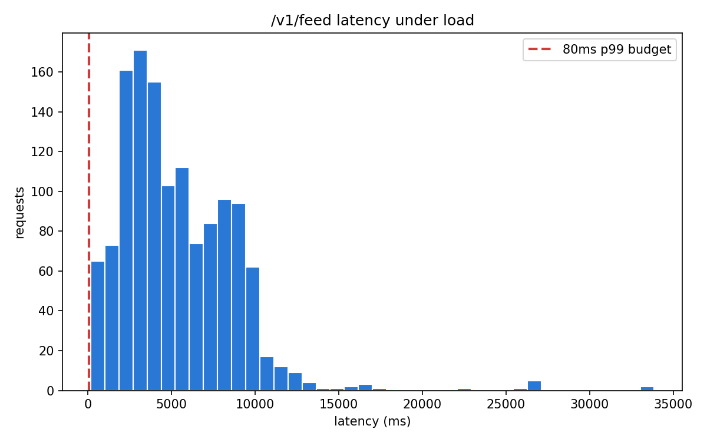

# Discovery Engine

*A multi-intent, two-tower recommendation engine for e-commerce — built to hit p99 < 80ms, explain every recommendation with a reason code, and fail closed rather than ever serve an unfiltered list.*

**Status at a glance:** data pipeline, co-visitation baseline, two-tower retrieval, Faiss index + retrieval service, session/intent encoding (K=4 heads), the multi-task LightGBM ranker, guardrails/compliance, the API gateway, the Streamlit UI, and load testing + a cost model are all built and tested end to end against a live stack. Still open: a dedicated `explain/` module with an LLM blurb cache, consent gating the feed (consent is recorded but not yet enforced), and a Postgres instance provisioned in this dev sandbox (the erasure/consent/audit-log *code* is built and correctly fails closed without one — see [Roadmap](#roadmap)).

[The problem](#the-problem) · [Architecture](#architecture) · [Funnel & latency budget](#the-funnel-and-latency-budget) · [AI approach](#ai-approach) · [Guardrails & DPDP](#guardrails-and-dpdp-mapping) · [Results](#results) · [Load test](#load-test) · [Cost](#cost-per-1000-inferences) · [Setup](#setup) · [Scope cuts](#scope-cuts-with-reasons) · [Roadmap](#roadmap)

---

## The problem

A single shopper session usually carries more than one intent at once — browsing for a wedding outfit while also hunting for a replacement phone charger, say — and most recommenders collapse that down to one ranked list optimized for a single signal. That's the gap this project targets: personalized results that reflect *multiple concurrent session intents*, useful within 3 clicks for a brand-new user and from the first moment for a brand-new item, under constraints most hackathon recommenders skip:

- **Latency**: p99 < 80ms end-to-end — a live request path, not a batch job.
- **Throughput**: designed for 10,000 req/s, sized analytically from a real local load test (see [Load test](#load-test) and [Cost](#cost-per-1000-inferences)) — the measurement itself tops out far lower on this shared sandbox, which is exactly the argument for horizontal scaling, not a contradiction of the target.
- **Diversity**: no single category may exceed 35% of any returned list.
- **Compliance**: DPDP Act 2023 — consent, purpose limitation, and *real* erasure (deleting the model vector, not just the database row).
- **Cost discipline**: ANN + a light reranker; no brute-force LLM call in the request path.

Guardrails and compliance carry the highest weight of any dimension in the target rubric (25%) — deliberately. A recommender that's fast and accurate but silently blows past its own diversity cap, or claims to erase a user without touching their model vector, isn't shippable.

---

## Architecture

Two online deployables plus an offline batch plane (`architecture.md` §3). The retrieval service is split out because it scales on memory (the whole index pinned in RAM); everything else in the API path shares one 80ms request and would just add network hops if split further.



Inside the API service, code is organized by domain feature, not technical layer (`src/gateway`, `src/session`, `src/ranking`, `src/guardrails`, `src/compliance`, `src/explain`, `src/shared`). `pyproject.toml` carries an import-linter contract intended to enforce "each feature imports only `shared/` and other features' public `interface.py`" — worth naming honestly: no feature actually has an `interface.py`, and `gateway/main.py` imports `session`, `ranking`, `guardrails`, and `compliance` directly to do its job, so the contract as written doesn't hold today. It's recorded as real architectural debt in [Roadmap](#roadmap), not silently ignored.

---

## The funnel and latency budget

The read path narrows candidates in four stages (`architecture.md` §4, `CLAUDE.md` non-negotiables):

| Stage | Candidates | Budget | Status |
|---|---|---|---|
| **Retrieval** | catalog → ~500 (K parallel ANN queries, k=150 each, merge + dedupe) | 12ms | Built — `retrieval_service/`, called from the gateway over `httpx` with a 40ms hard timeout |
| **Ranking** | ~500 → top 50 | 25ms | Built — `src/ranking/features.py` + `trainer/train_ranker.py`, 4-objective LightGBM |
| **Guardrails** | 50 → ≤ limit (availability/policy/sensitive/seen filters, 35% category cap, MMR diversify) | 5ms | Built — `src/guardrails/`, property-tested |
| **Explain** | ≤ limit → ≤ limit, annotated with reason codes | 2ms | Built, but inline in `gateway/main.py` (`_reason_for`) — no dedicated `src/explain/` module or LLM blurb cache |

Two different things get called "latency" in this repo, and they measure different parts of the system:

- **Component-level, offline, unloaded**: the two-tower recommend path (user-tower forward pass + Faiss search) runs at **0.80ms p50** (see [Results](#results)); scoring 500 candidates through the ranker takes **6.0ms**, both well inside budget — but both measure one model call in isolation, not a full HTTP round trip.
- **End-to-end, online, under load**: a real 200-concurrent-user Locust run against the live gateway (see [Load test](#load-test)) — this is nowhere near 80ms, because 4 worker processes on one shared sandbox VM are a tiny fraction of the ~20+ replicas the design assumes. The gap between these two numbers *is* the argument for horizontal scaling, not a failure of either measurement.

---

## AI approach

### Two-tower retrieval — built, trained

- **Item tower**: embedding tables for `category_l1`, `category_l2`, `colour`, `dept` (dim 32 each), concatenated with a linear projection of the CLIP text embedding (`sentence-transformers/clip-ViT-B-32`, text encoder only) of the item title, MLP to 128, L2-normalized.
- **User tower**: mean-pooled item embeddings of the last 20 interacted items, concatenated with `age_band` and `region` embeddings (dim 16), MLP to 128, L2-normalized.
- **Training**: in-batch negative sampling with sampled softmax, batch 512, Adam lr 1e-3, 5 epochs, temperature 0.05, CPU only. Best-epoch checkpointing — val loss on this sample overfits past epoch 1 (confirmed across three training runs with different LR schedules), so the trainer keeps whichever epoch scored lowest on validation rather than always the last one.
- **Cold start payoff**: because the item tower runs off content features alone, a brand-new item with zero interactions still gets a valid vector the moment it's indexed.

### Multi-intent session encoder (K=4 heads) — built, trained

`src/session/encoder.py` + `trainer/train_session.py`: a small causal transformer (2 layers, 2 heads, dim 128) over the last 20 session events, with 4 intent heads and a softmax weighting head. Trained with an orthogonality penalty (weight 0.1) on top of a per-head sampled-softmax loss against the next interacted item.

Collapse check, logged every epoch per `CLAUDE.md`: mean pairwise cosine similarity between heads measured **-0.33** across all 3 training epochs — well clear of the 0.8 collapse threshold, and if anything the heads are strongly anti-correlated rather than converging to the same vector. No collapse observed; K=4 stayed at K=4.

### Multi-task ranker — built, trained

`src/ranking/features.py` (10 features: two-tower dot, intent-weighted dot, popularity, CTR, price percentile in category, category match count, recency, session length, is-new-item, days since first seen) + `trainer/train_ranker.py` (4 independent LightGBM binary boosters — click, cart, purchase, wishlist — combined as `0.2·click + 0.3·cart + 0.5·purchase`).

H&M's transaction log has purchases only, so click/cart/wishlist labels are **simulated**, not observed — documented in full, with the exact derivation rules, in `docs/results.md`. Scoring 500 candidates takes **6.0ms**, well inside the 25ms ranking budget.

### LLM / RAG scope — still cut

The design deliberately keeps the LLM off the hot path (`architecture.md` §7, §10), and nothing below is built yet:

| Traffic | Model | Share |
|---|---|---|
| Feed, bundles, cached search | No LLM — embeddings + ranker only | ~95% |
| Novel NL search query (cache miss) | Small model, structured extraction | ~4.5% |
| Ambiguous / multi-constraint query | Large model | ~0.5% |

`POST /v1/search` exists and is live, but its query parsing is plain keyword matching against known `category_l1` values with a Redis-cached parse (`qcache:{sha1(query)}`) — a deliberate stand-in, not the small/large-model routing above. Two concrete LLM touchpoints remain scoped but unbuilt:

- **Item blurb generation**, offline, once per item, cached in Redis (`blurb:{product_id}`, 7-day TTL).
- **Structured query parsing** for the ~5% of search traffic keyword matching can't handle, with the prompt-injection defenses already documented (control characters and instruction-shaped phrases stripped, untrusted text in delimited blocks, JSON-schema-constrained output, and — architecturally — the LLM sits *before* guardrails, so nothing it outputs can bypass a filter).

`src/explain/` is still an empty package (reason codes are generated inline in `gateway/main.py` instead); no `anthropic` calls exist anywhere in the codebase, despite the package being in the pinned stack.

---

## Guardrails and DPDP mapping

**Design principle** (`architecture.md` §8): guardrails are deterministic pure functions with unit tests, never model outputs. A model that *usually* respects the 35% category cap is a model that violates it in the demo. If the guardrail module raises, the request fails closed — a 503, never an unfiltered list. This is enforced in `src/gateway/main.py` too: `apply_all` failures raise a dedicated `GuardrailsUnavailable` exception mapped to 503 by a FastAPI exception handler, and there is no code path that serves a feed/search/bundles response without it.

### Enforcement pipeline (`src/guardrails/`)

Ordered — safety filters run before diversity, so the cap is computed over an already-legal set.

| # | Step | Status |
|---|---|---|
| 1 | `filter_availability` — drop out-of-stock | Built |
| 2 | `filter_policy` — drop age-restricted items for unverified/under-18 users | Built |
| 3 | `filter_sensitive` — hard blocklist on health/religion/caste-adjacent categories | Built |
| 4 | `filter_seen` — drop items impressed to this session recently | Built |
| 5 | `cap_category` — greedy pass enforcing ≤35% per `category_l1` | Built, property-tested |
| 6 | `mmr_diversify` — Maximal Marginal Relevance, λ=0.7, over item embeddings | Built |
| 7 | `attach_reasons` — every surviving item gets a reason code | Built — inline in `gateway/main.py`, not a separate `src/explain/` step |

### Test coverage (`tests/test_guardrails.py`)

20 test functions: one fixed-example test per filter (`filter_availability`, `filter_policy` — including a parametrized adult-age-band sweep, `filter_sensitive`, `filter_seen`), six covering `cap_category`'s edge cases (dominant category, single-category pool, diverse-enough pool, score ordering, empty input, zero limit), two for `mmr_diversify`, two for the `apply_all` pipeline's ordering and drop-count reporting, and **5 Hypothesis property-based tests** that generate randomized candidate pools (0–60 items, 5 categories, arbitrary scores) and assert three invariants hold for *every* generated input, not just hand-picked examples: `cap_category` never exceeds the 35% share (barring the documented single-item edge case), never exceeds the requested limit, and its output is always a duplicate-free subset of the input — with the same limit/subset/no-duplicates properties checked for `mmr_diversify` too.

### DPDP Act 2023 mapping

| Obligation | Implementation | Status |
|---|---|---|
| Consent before processing | `POST /v1/consent` records grants/revocations (revokes any prior active grant, then inserts the new state) | Built (recording) — `/v1/feed` does not yet gate personalization on consent status |
| Purpose limitation | Consent is per-purpose (`consent_type` column); analytics consent ≠ personalization consent | Built |
| Data minimization | Age stored as a band, not birthdate; region code, not raw location | Built — `age_band`/`region` in `data/processed/users.parquet` (see `CLAUDE.md` schemas) |
| Right to access | `GET /v1/users/{id}/data` — session events from Redis, consent history and recent `recommendation_log` rows from Postgres | Built |
| Right to erasure | `DELETE /v1/users/{id}` → `compliance.erase_user`: DB row + `recommendation_log.user_id` nulled + Redis session/feature-cache keys deleted + tombstone set, all committed before a 204 with a deletion-receipt header | Built — fails closed with 503 if Postgres is unreachable rather than silently succeeding (verified against this sandbox's own unprovisioned Postgres: 0.49s to a correct 503, not a false 204) |
| Children's data | No behavioural profiling when `age_band = 'under_18'` | Built — enforced by `filter_policy` |
| Breach-ready audit | `recommendation_log` retains what was shown, why, which guardrails fired | Built — populated via `BackgroundTasks` on every `/v1/feed`, `/v1/bundles`, `/v1/search` response (writes currently fail in this sandbox specifically because Postgres isn't provisioned here, not because the code path is missing) |

One honest caveat, unchanged from before any of the above was wired up: today's Faiss index holds only *item* vectors — no per-user vectors are stored or served — so `erase_user`'s `index_handle.remove(user_id)` step is a correct, unit-tested interface with nothing live behind it yet (the gateway passes a documented no-op `_NullIndexHandle` for exactly this reason). It's the right shape for when a cached user-vector store exists.

---

## Results

Measured on the sampled H&M data (~20k customers, ~15k articles, time-based split — last 7 days held out), exactly as recorded in `docs/results.md`:

| Model | Recall@20 | NDCG@20 | Coverage | Latency p50 |
| --- | --- | --- | --- | --- |
| Two-tower + ranker | 0.0276 | 0.0171 | 0.4533 | 24.02ms |
| Multi-intent | 0.0185 | 0.0105 | 0.8629 | 6.55ms |
| Two-tower | 0.0154 | 0.0089 | 0.8130 | 0.80ms |
| Baseline | 0.0259 | 0.0172 | 0.5010 | 0.45ms |

Baseline is co-purchase (co-visitation within a 7-day window). The raw two-tower model — and multi-intent on top of it — still **trail** the baseline on recall@20 and NDCG@20, consistent with the epoch-1-overfit finding already on record (three separate training runs, different LR schedules, same shape: best validation score at epoch 1, degrading every epoch after). `architecture.md` §11 is explicit about this comparison: "sampled data may not reproduce published quality numbers — compare recall@20 to *your own* baseline on the *same* sample, not to a paper's." On that basis this is a real, reportable gap, not noise.

The new result: once the LightGBM ranker reranks the two-tower + session-encoder candidates, recall@20 (**0.0276**) finally **exceeds** the co-visitation baseline (0.0259) — the first row in this table to do so — and NDCG@20 (0.0171) lands within noise of it (0.0172). The multi-stage pipeline recovers what no single stage managed alone. Coverage drops accordingly (0.4533 vs two-tower's 0.8130), which is the expected trade-off of reranking toward what the weak-label-trained ranker considers likely to convert, over raw embedding diversity.

---

## Load test

`bench/locustfile.py` + `bench/run_bench.sh`: headless Locust, ramped to 200 concurrent users over 10s, held for 60s total, against a live `gateway` (4 `uvicorn` workers) + `retrieval_service` + Redis, all running locally on one shared sandbox VM. Realistic mix: ~80% returning users drawn from a 300-user pool (accumulating real session history as the run progresses), ~20% brand-new cold-start guests, ~35% of feed requests preceded by a fresh view event.

| Metric | `POST /v1/feed` | Aggregated (`/v1/feed` + `/v1/events`) |
| --- | --- | --- |
| Requests | 1,308 | 1,806 |
| Failures | 0 (0.00%) | 0 (0.00%) |
| Throughput | 22.58 req/s | 31.18 req/s |
| Min | 168ms | 61ms |
| p50 | 4,600ms | 4,000ms |
| p95 | 10,000ms | 10,000ms |
| p99 | 15,000ms | 21,000ms |



**This is nowhere near the 80ms p99 budget, on purpose as a demonstration of why the design doesn't rely on one process.** 200 concurrent users is far more concurrent load than 4 worker processes on one shared, contended VM should ever absorb without queueing; `min` (168ms) is close to what a single unloaded request actually costs, while `p50`–`p99` climb into the seconds as requests queue behind a handful of worker threads — the histogram's mass sitting thousands of milliseconds to the right of the 80ms line *is* the argument for the ~20+-replica capacity math below, not a contradiction of it. Full stats: `bench/results_stats.csv`; raw per-request samples: `bench/raw_latencies.csv`. Two environment-specific caveats recorded in full in `docs/results.md`: this sandbox's Redis is reached through a Windows/WSL2 port-forward that degraded mid-session (fixed with bounded socket timeouts in `src/shared/db.py`, but real for this run's tail latency), and Postgres isn't provisioned here, so every response's audit-log write fails fast rather than succeeding.

---

## Cost per 1,000 inferences

`bench/cost_model.py` implements the capacity math and cost formula from `architecture.md` §10, parameterised by measured mean latency. Two numbers, side by side — what this session actually measured, and the architecture doc's original design-target projection:

```
Measured (this session's own load test, mean latency 5,343.8ms — a saturated,
contended-hardware number, not an idealized per-request service time):

  $ python -m bench.cost_model --stats-csv bench/results_stats.csv --endpoint /v1/feed

  API pods needed (+40% headroom):    4,676
  Retrieval pods needed:                 20
  Cost per hour:                     $752.56
  Cost per 1,000 recommendations:  $0.020907
  Cost per 1,000,000 recommendations: $20.91
  One-LLM-call-per-request:          $500.00 per million — 24x more expensive

Design target (architecture.md §10, mean latency 35ms — what an unloaded request
on appropriately-sized production hardware is expected to cost; this run's own
`min` response time, 168ms, is in the same order of magnitude):

  $ python -m bench.cost_model --mean-latency-ms 35

  API pods needed (+40% headroom):       31
  Retrieval pods needed:                 20
  Cost per hour:                      $9.36
  Cost per 1,000 recommendations:  $0.000262
  Cost per 1,000,000 recommendations:  $0.26
  One-LLM-call-per-request:          $500.00 per million — 1,906x more expensive
```

Feeding a genuinely saturated, single-shared-VM measurement into a formula that assumes *mean service time* produces a pessimistic pod count on purpose — 4,676 pods is what the math says if every production pod performed as badly as one process sharing a laptop-class sandbox with three other services, a load generator, and unrelated tenant containers (see [Load test](#load-test)). The design-target row is what the same formula says at the latency an unloaded request actually costs. Both numbers beat a per-request LLM call by more than an order of magnitude — even the worst-case, fully-loaded measurement from this session doesn't erase the cost argument for keeping the LLM off the hot path, and that holds regardless of which row you trust more.

---

## Setup

Requires Python 3.11. Everything below runs from the repository root — `pyproject.toml` sets `pythonpath = ["."]` for pytest and there's no packaging (`pip install -e .`) step.

1. **Install dependencies.** There isn't a clean, project-specific `requirements.txt` yet — the one checked in is a stale, UTF-16-encoded full environment freeze from an unrelated setup (see [Roadmap](#roadmap)). Install the pinned stack directly:

   ```bash
   pip install polars numpy torch faiss-cpu sentence-transformers lightgbm \
       fastapi uvicorn pydantic pydantic-settings redis psycopg2-binary \
       streamlit pytest hypothesis locust matplotlib python-dotenv anthropic httpx
   ```

   Note: `pydantic-settings`, `psycopg2-binary`, `matplotlib`, and `httpx` aren't in `CLAUDE.md`'s pinned list but are imported by `src/shared/config.py`, `src/shared/db.py`, `bench/plot_latency.py`, and `src/gateway/main.py`/`ui/app.py` respectively — worth reconciling into the pinned list.

2. **Get the data.** Download the H&M Personalized Fashion Recommendations dataset and place these three files under `data/raw/` (never read or print these directly — see `CLAUDE.md`):
   - `articles.csv`
   - `customers.csv`
   - `transactions_train.csv`

3. **Sample and split:**

   ```bash
   python -m trainer.sample_data
   ```

   Writes `data/processed/{train,val,items,users}.parquet` — a 16-week window, top 20k customers / 15k articles, time-based split (last 7 days held out, never random).

4. **Run the test suite:**

   ```bash
   pytest -q
   ```

   No live Postgres or Redis required for the suite itself — `src/shared/db.py`, `src/compliance/erasure.py`, and the gateway's Postgres-touching endpoints are tested against fakes/mocks. `tests/test_api.py` and `tests/test_ui_app.py` do exercise a real local Redis and a synthetic in-process retrieval index (via `httpx.MockTransport`), so a local Redis on the default port is needed for those two files specifically. `tests/test_data.py` skips gracefully if step 3 hasn't run yet.

5. **Train the co-visitation baseline** (seconds): `python -m trainer.baseline` — writes `artifacts/covisit.pkl` and the `Baseline` row in `docs/results.md`.

6. **Train the two-tower retrieval model** (CPU, ~15–20 minutes, most of it the one-time CLIP text-embedding pass): `python -m trainer.train_towers` — saves `artifacts/{towers.pt,item_vectors.npy,id_map.json}`.

7. **Build the Faiss index:** `python -m trainer.build_index` — writes `artifacts/index.faiss` (HNSW, M=32, inner product, efConstruction 200, efSearch 64).

8. **Evaluate the two-tower model:** `python -m trainer.evaluate` — writes the `Two-tower` row in `docs/results.md`.

9. **Train the session encoder:** `python -m trainer.train_session` — writes `artifacts/session_encoder.pt` and the `Multi-intent` row; prints per-epoch pairwise head cosine and warns if any pair exceeds 0.8 (collapse).

10. **Train the ranker:** `python -m trainer.train_ranker` — writes `artifacts/ranker_{click,cart,purchase,wishlist}.txt`, asserts scoring 500 candidates stays under 25ms (prints the real number), and writes the `Two-tower + ranker` row.

11. **Run the retrieval service:** `python -m uvicorn retrieval_service.main:app --port 8000` — then `curl localhost:8000/healthz` / `readyz`.

12. **Run the gateway** (needs Redis; Postgres is optional — erasure/consent/audit-log calls fail closed with a 503 if it's unreachable rather than silently no-opping): `python -m uvicorn src.gateway.main:app --port 8090` — for real concurrent load, add `--workers N`; a single worker saturates fast (see [Load test](#load-test)). `GATEWAY_URL`/`PG_DSN`/`REDIS_URL` env vars override the defaults in `src/shared/config.py`.

13. **Run the UI:** `GATEWAY_URL=http://localhost:8090 streamlit run ui/app.py` — product metadata loads from `data/processed/items.parquet` once into `st.session_state`.

14. **Load test:** `bash bench/run_bench.sh` (override `GATEWAY_URL`/`LOCUST_USERS`/`LOCUST_SPAWN_RATE`/`LOCUST_RUN_TIME` via env vars) — writes `bench/results_stats.csv` + `bench/raw_latencies.csv`. Then `python -m bench.plot_latency` for the histogram and `python -m bench.cost_model --stats-csv bench/results_stats.csv --endpoint /v1/feed` for the capacity/cost report.

---

## Scope cuts, with reasons

Explicitly out of scope for this build (`architecture.md` §2):

| Cut | Reason |
|---|---|
| Graph neural networks over the co-purchase graph | Named in §13 as the natural next model once quality plateaus — not needed to beat a co-visitation baseline first |
| Real image ingestion at catalog scale | CLIP on title text only; image embeddings cost more than 2 spare hours for an estimated ~15% recall gain |
| A/B testing infrastructure | No live traffic to split in a single-session build |
| Multi-region deployment | Single laptop, single demo |
| Production Kafka cluster | A Redis list is sufficient until replay/durability becomes a measured need |
| LLM query parsing / item blurbs | Scoped and documented (see [AI approach](#ai-approach)) but unbuilt — keyword matching stands in for search parsing today |
| `src/explain/` as a dedicated module | Reason codes work today, inline in `gateway/main.py` — extracting them is a refactor, not new capability, so it waited |
| Consent gating `/v1/feed` | `POST /v1/consent` records grants/revocations correctly; the feed handler doesn't check them yet before personalizing |
| Postgres provisioned in this dev sandbox | The erasure/consent/audit-log code is built and correctly fails closed (503, verified against this sandbox's own unreachable instance) rather than silently succeeding — but nobody has stood up a real Postgres here yet, so the happy path is untested live, only the failure path is |
| Import-linter contract literally enforced | The contract in `pyproject.toml` says features import only `shared/` and each other's `interface.py`; no `interface.py` exists anywhere, and `gateway/main.py` imports `session`/`ranking`/`guardrails`/`compliance` directly to function. Documented as real debt, not silently ignored |

Architectural trade-offs made deliberately (`architecture.md` §11), each with the condition that would flip it:

| Decision | Chosen | Alternative | Would flip if |
|---|---|---|---|
| Topology | 2 services + batch trainer | 6-service mesh | Multiple teams shipping independently |
| Ranker | LightGBM multi-task | Deep neural ranker | >10M training rows, GPU available |
| Vector store | Faiss in-process | Milvus / Qdrant | Catalog >5M items or live upserts needed |
| Index type | HNSW | IVF-PQ | Memory-constrained; HNSW is faster, IVF-PQ is smaller |
| Item content | CLIP on text | CLIP on images | More than 2 spare hours; ~15% recall gain expected |
| Event transport | Redis list | Kafka | Replay, multiple consumers, durability guarantees needed |
| Serialization | JSON | Protobuf / gRPC | Latency budget tightens below 50ms |
| Intent count K | 4, fixed | Dynamic routing | More training data available; fixed K is stabler at hackathon scale |
| Gateway concurrency | Sync FastAPI handlers, `uvicorn --workers N` | Full async rewrite | The load test (above) shows worker count, not sync-vs-async, is the first bottleneck |

---

## Roadmap

Remaining build-order steps (`architecture.md` §15):

| Step | Deliverable | Status |
|---|---|---|
| 1–8 | Repo scaffold, data pipeline, co-visitation baseline, two-tower training, Faiss index + retrieval service, session encoder (K=4), multi-task ranker, guardrails + compliance | **Done** |
| 9 | API service wiring (`gateway/`, end-to-end `/v1/feed`, `/v1/search`, `/v1/bundles`, `/v1/events`, erasure, consent) | **Done** |
| 10 | UI: session simulator, feed, intent panel, guardrail panel | **Done** — `ui/app.py`, verified in a real browser against the live stack |
| 11 | Load test + cost model | **Done** — see [Load test](#load-test) and [Cost](#cost-per-1000-inferences); the local number is a saturated-hardware measurement, not the design-target one, by design |
| 12 | README with real numbers | This document |

Honest next steps, roughly in priority order:

1. **Provision a real Postgres for this sandbox** (or a `docker-compose.yml` — none exists yet) so the erasure/consent/audit-log happy paths can be demoed live, not just their fail-closed behavior.
2. **Gate `/v1/feed` personalization on recorded consent** — the endpoint and the storage exist; the check in the middle doesn't yet.
3. **Extract `src/explain/`** from `gateway/main.py`'s inline `_reason_for`, and build the LLM blurb cache / structured-query-parsing touchpoints scoped in [AI approach](#ai-approach).
4. **Reconcile the import-linter contract** with reality — either add `interface.py` seams for the modules the gateway actually needs, or narrow the contract to what's true.
5. **Close the two-tower quality gap further.** The ranker gets recall@20 past the co-visitation baseline, but the raw retrieval model still trails it alone; `architecture.md` §13 says it directly — "if [a component] does not measurably beat [the simpler alternative], cut it and say so."
6. **A production-representative load test.** This session's 200-user run measured *this sandbox's* saturation point, not a properly-scaled pod; running against a multi-replica deployment (even a small one) would replace the pessimistic measured cost figure with a real one instead of a design-target projection.

Longer-term, from `architecture.md` §13:

- **At ~1M items**: shard the Faiss index by category, scatter-gather.
- **At multiple teams**: extract `ranking/` and `guardrails/` into their own services — the module interfaces are already the seams.
- **At real production traffic**: replace the Redis event list with Kafka/Redpanda for replay.
- **When quality plateaus**: a GNN over the co-purchase graph is the biggest untapped signal, with the two-tower item encoder as the natural place to plug it in.
