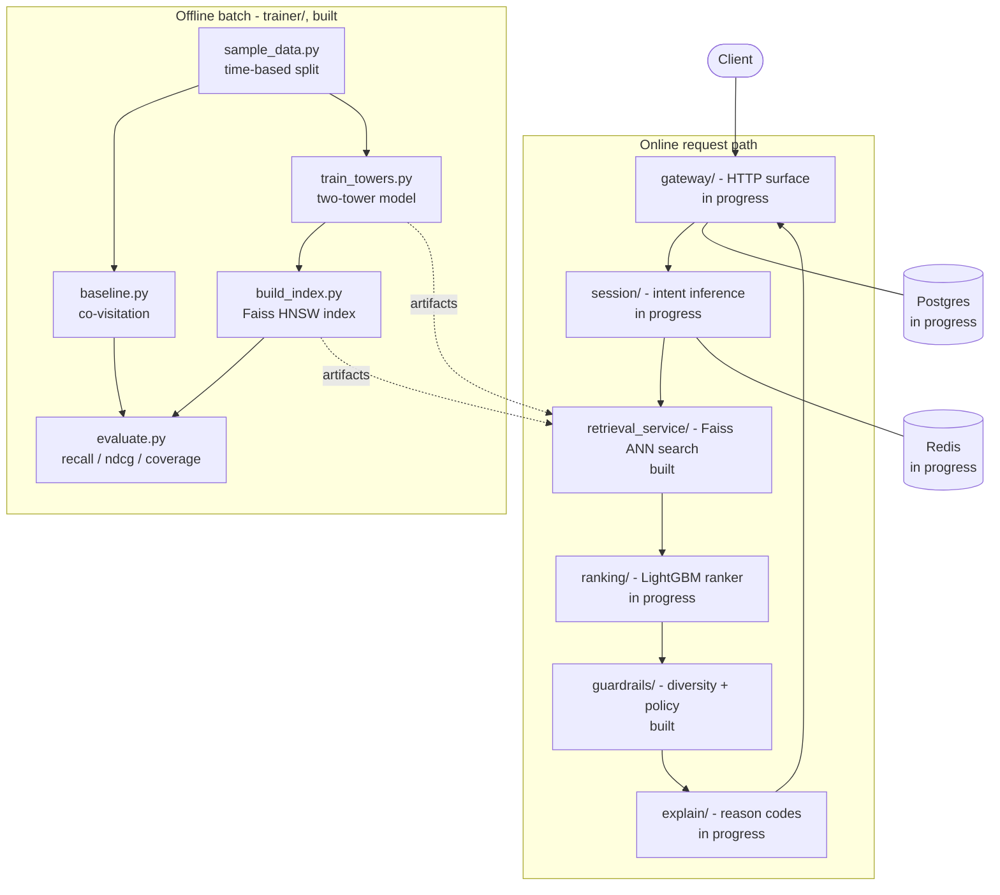

# Discovery Engine

*A multi-intent, two-tower recommendation engine for e-commerce — built to hit p99 < 80ms, explain every recommendation with a reason code, and fail closed rather than ever serve an unfiltered list.*

**Status at a glance:** data pipeline, co-visitation baseline, two-tower retrieval model, Faiss index, retrieval service, and guardrails/compliance are built and tested. Session/intent encoding, the multi-task ranker, the API gateway, explain, UI, and load testing are **in progress**. See [Roadmap](#roadmap).

[The problem](#the-problem) · [Architecture](#architecture) · [Funnel & latency budget](#the-funnel-and-latency-budget) · [AI approach](#ai-approach) · [Guardrails & DPDP](#guardrails-and-dpdp-mapping) · [Results](#results) · [Cost](#cost-per-1000-inferences) · [Setup](#setup) · [Scope cuts](#scope-cuts-with-reasons) · [Roadmap](#roadmap)

---

## The problem

A single shopper session usually carries more than one intent at once — browsing for a wedding outfit while also hunting for a replacement phone charger, say — and most recommenders collapse that down to one ranked list optimized for a single signal. That's the gap this project targets: personalized results that reflect *multiple concurrent session intents*, useful within 3 clicks for a brand-new user and from the first moment for a brand-new item, under constraints most hackathon recommenders skip:

- **Latency**: p99 < 80ms end-to-end — a live request path, not a batch job.
- **Throughput**: designed for 10,000 req/s (proven analytically — see [Cost](#cost-per-1000-inferences); not load-tested yet, see [Roadmap](#roadmap)).
- **Diversity**: no single category may exceed 35% of any returned list.
- **Compliance**: DPDP Act 2023 — consent, purpose limitation, and *real* erasure (deleting the model vector, not just the database row).
- **Cost discipline**: ANN + a light reranker; no brute-force LLM call in the request path.

Guardrails and compliance carry the highest weight of any dimension in the target rubric (25%) — deliberately. A recommender that's fast and accurate but silently blows past its own diversity cap, or claims to erase a user without touching their model vector, isn't shippable.

---

## Architecture

Two online deployables plus an offline batch plane (`architecture.md` §3). The retrieval service is split out because it scales on memory (the whole index pinned in RAM); everything else in the API path shares one 80ms request and would just add network hops if split further.



Inside the API service, code is organized by domain feature, not technical layer (`src/gateway`, `src/session`, `src/ranking`, `src/guardrails`, `src/compliance`, `src/explain`, `src/shared`), each importing only `shared/` and other features' public `interface.py` — a modular monolith with service-shaped seams, enforced by an import-linter contract.

---

## The funnel and latency budget

The read path narrows candidates in four stages (`architecture.md` §4, `CLAUDE.md` non-negotiables):

| Stage | Candidates | Budget | Status |
|---|---|---|---|
| **Retrieval** | catalog → ~500 (K parallel ANN queries, k=150 each, merge + dedupe) | 12ms | Built — `retrieval_service/` |
| **Ranking** | ~500 → top 50 | 25ms | In progress — `src/ranking/` is empty |
| **Guardrails** | 50 → ≤ limit (availability/policy/sensitive/seen filters, 35% category cap, MMR diversify) | 5ms | Built — `src/guardrails/` |
| **Explain** | ≤ limit → ≤ limit, annotated with reason codes | 2ms | In progress — `src/explain/` is empty |

Full modeled read path, including gateway and session (`architecture.md` §4): gateway validate/session-load (5ms) + session encode (8ms) + the four stages above (44ms) + gateway serialize (3ms) ≈ **60ms**, against the **80ms p99** budget — 20ms of deliberate headroom for GC pauses, cache misses, and tail network latency.

Our own measured latency so far: the two-tower recommend path (user-tower forward pass + Faiss search) runs at **0.80ms p50** end-to-end (see [Results](#results)) — well inside the 12ms retrieval budget, though this measures a single-query path, not yet the production K-parallel-query shape.

---

## AI approach

### Two-tower retrieval — built, trained

- **Item tower**: embedding tables for `category_l1`, `category_l2`, `colour`, `dept` (dim 32 each), concatenated with a linear projection of the CLIP text embedding (`sentence-transformers/clip-ViT-B-32`, text encoder only) of the item title, MLP to 128, L2-normalized.
- **User tower**: mean-pooled item embeddings of the last 20 interacted items, concatenated with `age_band` and `region` embeddings (dim 16), MLP to 128, L2-normalized.
- **Training**: in-batch negative sampling with sampled softmax, batch 512, Adam lr 1e-3, 5 epochs, temperature 0.05, CPU only. Best-epoch checkpointing — val loss on this sample overfits past epoch 1 (confirmed across three training runs with different LR schedules), so the trainer keeps whichever epoch scored lowest on validation rather than always the last one.
- **Cold start payoff**: because the item tower runs off content features alone, a brand-new item with zero interactions still gets a valid vector the moment it's indexed.

### Multi-intent (K=4 heads) — in progress

Target design (`CLAUDE.md`): K=4 intent heads with an orthogonality penalty in the loss, pairwise cosine similarity between heads logged every epoch, collapse flagged if any pair exceeds 0.8. `src/session/` is currently empty — no session encoder or intent heads exist yet. Given today's two-tower model isn't yet beating its own baseline (see [Results](#results)), the honest sequencing is to close that gap before layering intent heads on top.

### Multi-task ranker — in progress

Target design: a LightGBM ranker with 4 objectives (click, cart, purchase, wishlist), scoring the ~500 retrieval candidates and keeping the top 50. `src/ranking/` is empty and there is no `trainer/train_ranker.py` yet. Today, `trainer/evaluate.py`'s two-tower recommend function skips ranking entirely and reads results straight off the Faiss index.

### LLM / RAG scope — in progress

The design deliberately keeps the LLM off the hot path (`architecture.md` §7, §10):

| Traffic | Model | Share |
|---|---|---|
| Feed, bundles, cached search | No LLM — embeddings + ranker only | ~95% |
| Novel NL search query (cache miss) | Small model, structured extraction | ~4.5% |
| Ambiguous / multi-constraint query | Large model | ~0.5% |

Two concrete touchpoints are scoped, neither built yet:

- **Item blurb generation**, offline, once per item, cached in Redis (`blurb:{product_id}`, 7-day TTL) — this caching is what keeps the online cost target achievable.
- **Search query parsing**, with prompt-injection defenses since titles/descriptions are seller-supplied: control characters and instruction-shaped phrases stripped, untrusted text passed in delimited blocks, output constrained to a JSON schema, and — architecturally — the LLM sits *before* guardrails in the request path, so nothing it outputs can bypass a filter.

`src/explain/` (reason codes, blurb cache) is currently empty; no `anthropic` calls exist anywhere in the codebase yet, despite the package being in the pinned stack.

---

## Guardrails and DPDP mapping

**Design principle** (`architecture.md` §8): guardrails are deterministic pure functions with unit tests, never model outputs. A model that *usually* respects the 35% category cap is a model that violates it in the demo. If the guardrail module raises, the request fails closed — a 503, never an unfiltered list.

### Enforcement pipeline (`src/guardrails/`)

Ordered — safety filters run before diversity, so the cap is computed over an already-legal set.

| # | Step | Status |
|---|---|---|
| 1 | `filter_availability` — drop out-of-stock | Built |
| 2 | `filter_policy` — drop age-restricted items for unverified/under-18 users | Built |
| 3 | `filter_sensitive` — hard blocklist on health/religion/caste-adjacent categories | Built |
| 4 | `filter_seen` — drop items impressed to this session recently | Built |
| 5 | `cap_category` — greedy pass enforcing ≤35% per `category_l1` | Built, property-tested |
| 6 | `mmr_diversify` — Maximal Marginal Relevance, λ=0.7, over item embeddings | Built |
| 7 | `attach_reasons` — every surviving item gets a reason code | In progress — `src/explain/` is empty |

`cap_category` and `mmr_diversify` carry Hypothesis property tests (`tests/test_guardrails.py`): for arbitrarily generated candidate pools, output never exceeds the requested limit, never exceeds the 35% share (barring the documented single-item edge case), and is always duplicate-free — not just checked against hand-picked examples.

### DPDP Act 2023 mapping

| Obligation | Implementation | Status |
|---|---|---|
| Consent before processing | Consent checked before personalization; no consent → cold-start path | In progress — `consent` table exists in `sql/schema.sql`, nothing reads/writes it yet, no gateway |
| Purpose limitation | Consent is per-purpose; analytics consent ≠ personalization consent | In progress |
| Data minimization | Age stored as a band, not birthdate; region code, not raw location | Built — `age_band`/`region` in `data/processed/users.parquet` (see `CLAUDE.md` schemas) |
| Right to access | `GET /v1/users/{id}/data` | In progress — no gateway yet |
| Right to erasure | Deletes the DB row, session state, and (via `IndexHandle`) the model vector | Built — `src/compliance/erasure.py`, tested against fakes |
| Children's data | No behavioural profiling when `age_band = 'under_18'` | Built — enforced by `filter_policy` |
| Breach-ready audit | `recommendation_log` retains what was shown, why, which guardrails fired | In progress — table exists in `sql/schema.sql`, nothing writes to it yet |

One honest caveat: today's Faiss index holds only *item* vectors — no per-user vectors are stored or served — so `erase_user`'s `index_handle.remove(user_id)` step is a correct, unit-tested interface with nothing live behind it yet. It's the right shape for when a cached user-vector store exists.

---

## Results

Measured on the sampled H&M data (~20k customers, ~15k articles, time-based split — last 7 days held out), exactly as recorded in `docs/results.md`:

| Model | Recall@20 | NDCG@20 | Coverage | Latency p50 |
| --- | --- | --- | --- | --- |
| Baseline | 0.0259 | 0.0172 | 0.5010 | 0.45ms |
| Two-tower | 0.0154 | 0.0089 | 0.8130 | 0.80ms |

Baseline is co-purchase (co-visitation within a 7-day window). Two-tower currently **trails** it on recall and NDCG, while covering 62% more of the catalog and staying well under a millisecond. `architecture.md` §11 is explicit about this comparison: "sampled data may not reproduce published quality numbers — compare recall@20 to *your own* baseline on the *same* sample, not to a paper's." On that basis this is a real, reportable gap, not noise — three separate training runs with different LR schedules all showed the same shape: best validation performance at epoch 1, degrading every epoch after. See [Roadmap](#roadmap).

---

## Cost per 1,000 inferences

**Not yet measured.** `bench/` (locust load test, cost model) is empty, so nothing below is a measurement from this repo. These are the projected costs from `architecture.md` §10's capacity math, recorded here so the target is on the record before it's verified:

```
Online serving at 10,000 req/s:
  32 API pods × 4 vCPU × $0.04/vCPU-hr = $5.12/hr
  20 ANN pods × 4 vCPU × $0.04/vCPU-hr = $3.20/hr
  Redis + Postgres                     ≈ $1.20/hr
  Total                                ≈ $9.52/hr

Requests/hour: 10,000 × 3,600 = 36,000,000
Cost per 1,000 recommendations: $9.52 / 36,000 ≈ $0.00026

Offline (amortized): ≈ 2 GPU-hours/day for training + full catalog encode ≈ $2.00/day,
amortized over 864M daily requests ≈ $0.0000023 per 1,000
```

Headline: **~$0.26 per million recommendations**, projected. Compare to a naive one-LLM-call-per-request design at ~$0.0005/call ≈ $500 per million — roughly **1,900× more expensive**. That gap is why the LLM stays off the hot path (see [AI approach](#ai-approach)).

Turning this from a projection into a measurement is `bench/locustfile.py` + `bench/cost_model.py` — both open items in the [Roadmap](#roadmap).

---

## Setup

Requires Python 3.11. Everything below runs from the repository root — `pyproject.toml` sets `pythonpath = ["."]` for pytest and there's no packaging (`pip install -e .`) step.

1. **Install dependencies.** There isn't a clean, project-specific `requirements.txt` yet — the one checked in is a stale, UTF-16-encoded full environment freeze from an unrelated setup (see [Roadmap](#roadmap)). Install the pinned stack directly:

   ```bash
   pip install polars numpy torch faiss-cpu sentence-transformers lightgbm \
       fastapi uvicorn pydantic pydantic-settings redis psycopg2-binary \
       streamlit pytest hypothesis locust python-dotenv anthropic
   ```

   Note: `pydantic-settings` and `psycopg2-binary` aren't in `CLAUDE.md`'s pinned list but are imported by `src/shared/config.py` and `src/shared/db.py` respectively — worth reconciling into the pinned list.

2. **Get the data.** Download the H&M Personalized Fashion Recommendations dataset and place these three files under `data/raw/` (never read or print these directly — see `CLAUDE.md`):
   - `articles.csv`
   - `customers.csv`
   - `transactions_train.csv`

3. **Sample and split:**

   ```bash
   python -m trainer.sample_data
   ```

   Writes `data/processed/{train,val,items,users}.parquet` — a 16-week window, top 20k customers / 15k articles, time-based split (last 7 days held out, never random).

4. **Run the test suite:**

   ```bash
   pytest -q
   ```

   No live Postgres or Redis required — `src/shared/db.py` and `src/compliance/erasure.py` are tested against fakes/mocks. `tests/test_data.py` skips gracefully if step 3 hasn't run yet.

5. **Train the co-visitation baseline** (seconds):

   ```bash
   python -m trainer.baseline
   ```

   Writes `artifacts/covisit.pkl` and the `Baseline` row in `docs/results.md`.

6. **Train the two-tower retrieval model** (CPU, ~15–20 minutes — most of it is the one-time CLIP text-embedding pass, cached to `artifacts/item_text.npy` after the first run):

   ```bash
   python -m trainer.train_towers
   ```

   Prints val loss per epoch, saves `artifacts/{towers.pt,item_vectors.npy,id_map.json}`.

7. **Build the Faiss index:**

   ```bash
   python -m trainer.build_index
   ```

   Writes `artifacts/index.faiss` (HNSW, M=32, inner product, efConstruction 200, efSearch 64).

8. **Evaluate the two-tower model against the baseline:**

   ```bash
   python -m trainer.evaluate
   ```

   Writes the `Two-tower` row in `docs/results.md` (see [Results](#results)).

9. **Run the retrieval service locally:**

   ```bash
   python -m uvicorn retrieval_service.main:app --reload
   ```

   Then:

   ```bash
   curl localhost:8000/healthz
   curl localhost:8000/readyz          # 503 until artifacts/index.faiss + id_map.json exist
   ```

   `/search` expects one or more 128-dim query vectors (illustrative — real values come from the user tower, not hand-written):

   ```bash
   curl -X POST localhost:8000/search -H "content-type: application/json" \
     -d '{"vectors": [[0.01, 0.02, "...", 0.03]], "k": 10, "exclude": []}'
   ```

---

## Scope cuts, with reasons

Explicitly out of scope for this build (`architecture.md` §2):

| Cut | Reason |
|---|---|
| Graph neural networks over the co-purchase graph | Named in §13 as the natural next model once quality plateaus — not needed to beat a co-visitation baseline first |
| Real image ingestion at catalog scale | CLIP on title text only; image embeddings cost more than 2 spare hours for an estimated ~15% recall gain |
| A/B testing infrastructure | No live traffic to split in a single-session build |
| Multi-region deployment | Single laptop, single demo |
| Production Kafka cluster | A Redis list is sufficient until replay/durability becomes a measured need |

Architectural trade-offs made deliberately (`architecture.md` §11), each with the condition that would flip it:

| Decision | Chosen | Alternative | Would flip if |
|---|---|---|---|
| Topology | 2 services + batch trainer | 6-service mesh | Multiple teams shipping independently |
| Ranker | LightGBM multi-task | Deep neural ranker | >10M training rows, GPU available |
| Vector store | Faiss in-process | Milvus / Qdrant | Catalog >5M items or live upserts needed |
| Index type | HNSW | IVF-PQ | Memory-constrained; HNSW is faster, IVF-PQ is smaller |
| Item content | CLIP on text | CLIP on images | More than 2 spare hours; ~15% recall gain expected |
| Event transport | Redis list | Kafka | Replay, multiple consumers, durability guarantees needed |
| Serialization | JSON | Protobuf / gRPC | Latency budget tightens below 50ms |
| Intent count K | 4, fixed | Dynamic routing | More training data available; fixed K is stabler at hackathon scale |

---

## Roadmap

Remaining build-order steps (`architecture.md` §15):

| Step | Deliverable | Status |
|---|---|---|
| 1–5 | Repo scaffold, data sampling, co-visitation baseline, two-tower training, Faiss index + retrieval service | **Done** |
| 6 | Session encoder + intent heads (K=4, orthogonality penalty) | In progress — `src/session/` is empty |
| 7 | Multi-task LightGBM ranker (click/cart/purchase/wishlist) | In progress — `src/ranking/` is empty |
| 8 | Guardrails + compliance | **Done** — `src/guardrails/`, `src/compliance/erasure.py`, property tests green |
| 9 | API service wiring (`gateway/`, end-to-end `/v1/feed`) | In progress — `src/gateway/` is empty |
| 10 | UI: three surfaces + intent panel | In progress — `ui/` is empty |
| 11 | Load test + cost model | In progress — `bench/` is empty; cost numbers above are projections, not measurements |
| 12 | README with real numbers, demo recorded | This document has real numbers; demo recording is separate |

Before adding more model complexity, the honest next step is closing the gap the [Results](#results) table already shows: the two-tower model currently trails the co-visitation baseline on recall@20 and NDCG@20. `architecture.md` §13 says it directly — "if [a component] does not measurably beat [the simpler alternative], cut it and say so." That applies here before multi-intent heads get layered on top of a retrieval model that isn't yet winning on its own.

Longer-term, from `architecture.md` §13:

- **At ~1M items**: shard the Faiss index by category, scatter-gather.
- **At multiple teams**: extract `ranking/` and `guardrails/` into their own services — the module interfaces are already the seams.
- **At real production traffic**: replace the Redis event list with Kafka/Redpanda for replay.
- **When quality plateaus**: a GNN over the co-purchase graph is the biggest untapped signal, with the two-tower item encoder as the natural place to plug it in.
